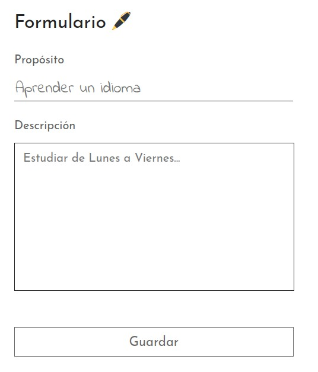
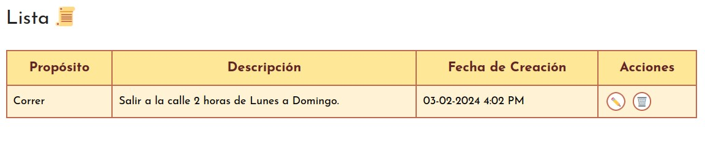
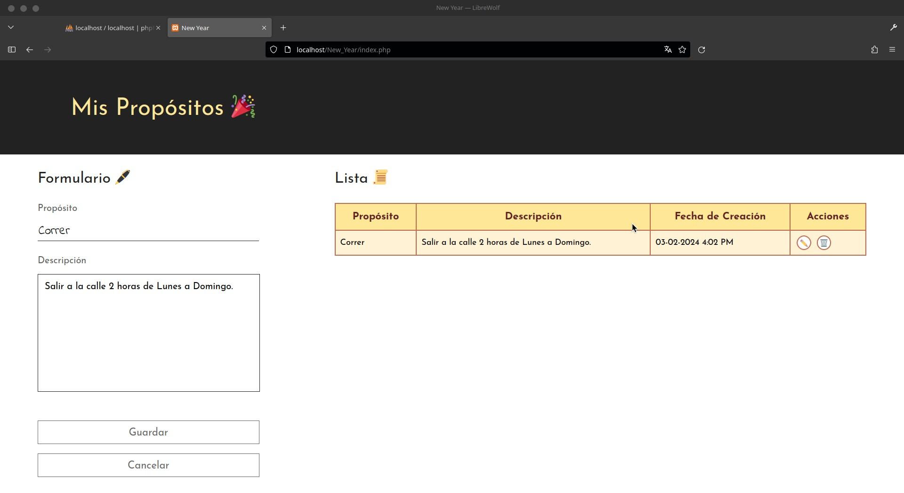
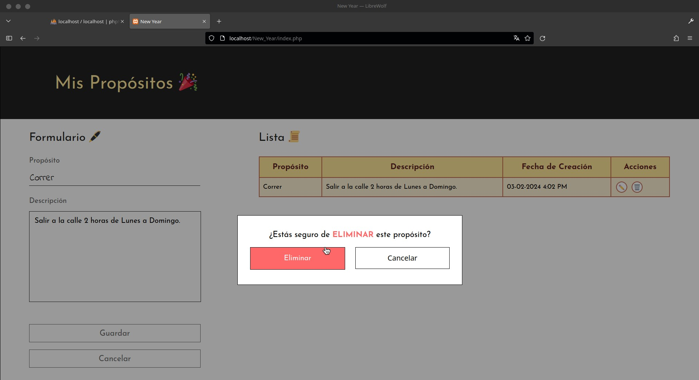

<h1 align="center">🗒️ ToDo - New Year 🎆</h1>

 

    Lista para crear, ver, editar y eliminar propósitos personales de <b>Año Nuevo</b>.

    Consta de un formulario (Create, Update, Delete) y una tabla (Read).

<h3>Create</h3>

<h3>Read</h3>

<h3>Update</h3>

<h3>Delete</h3>

 

<h2>Tecnologías</h2>
<ul>
    <li>🐘 PHP</li>
    <li>📜 JavaScript</li>
    <li>🐬 MySQL</li>
    <li>🏷️ HTML</li>
    <li>🖼️ CSS</li>
</ul>

 

<h2>Desarrollador</h2>
Hiram Shamed Ambriz Rubio
 
 

 